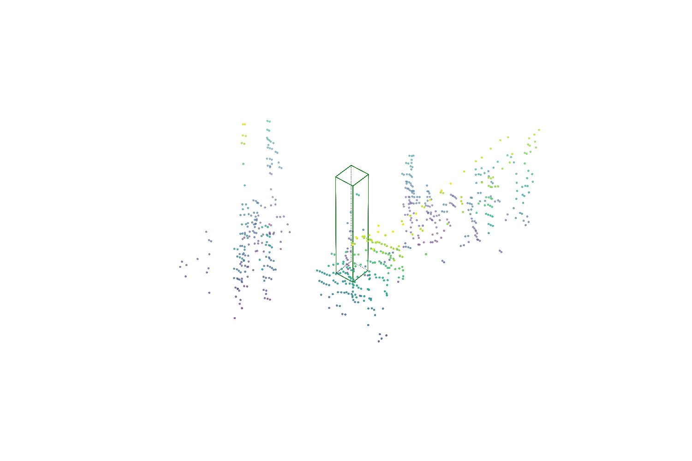
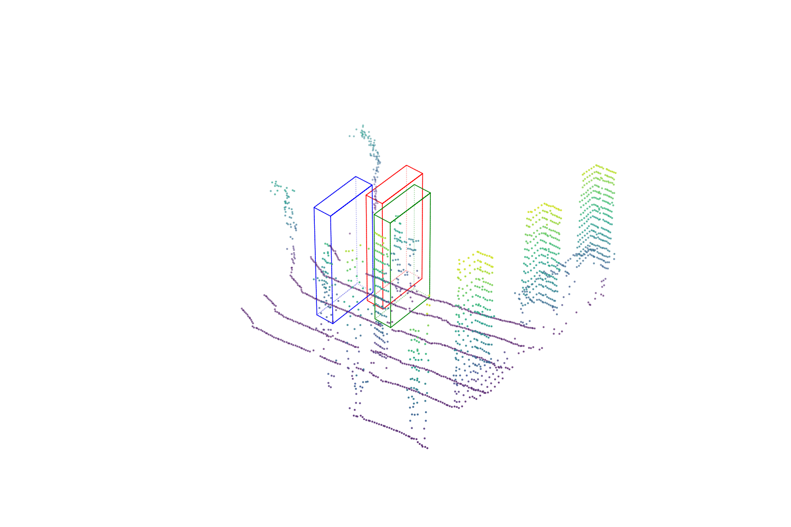

# [ICCV23] MixCycle: Mixup Assisted Semi-Supervised 3D Single Object Tracking witd Cycle Consistency

**[[Paper]](https://arxiv.org/abs/2303.09219) / [[Training]](./README.md#training)  / [[Testing]](./README.md#testing)**

This repository is the official release code for our ICCV23 paper MixCycle.

We propose **the first semi-supervised approach to 3D Single Object Tracking**. Our method, MixCycle, uses self and forward-backward cycle-consistency for supervision, and introduce a data augmentation strategy named SOTMixup to improve the tracker's robustness to point cloud diversity. It is **generalizes to appearance matching-based trackers**.

<p align="center">

</p>

<table border="0", style="border-collapse: collapse;">
  <tr>
    <td></td>
    <td></td>
  </tr>
  <tr>
    <td></td>
    <td></td>
  </tr>
  <tr>
    <td colspan="2"></td>
  </tr>
</table>

## Setup

* Environment

```shell
git clone https://github.com/Mumuqiao/MixCycle.git
cd MixCycle
conda create -n MixCycle  python=3.8
conda activate MixCycle
```

* Pytorch 1.7.1 cu110

```shell
pip install torch==1.7.1+cu110 torchvision==0.8.2+cu110 torchaudio==0.7.2 -f https://download.pytorch.org/whl/torch_stable.html
```

* Dependencies

```shell
pip install -r requirement.txt
```

## Quick Start

### Training

```bash
CUDA_VISIBLE_DEVICES=0,1 python main.py  --cfg cfgs/CYCBAT_Car.yaml  --batch_size 64 --epoch 200 --logdir ./results --preloading
```

**Note:** Before running the code, you will need to edit the `.yaml` file under the [*cfgs*](./cfgs) by setting the `path` argument as the correct root of the dataset.

After you start training, you can start Tensorboard to monitor the training process:

```shell
tensorboard --logdir=./ --port=6006
```

By default, the trainer runs a full evaluation on the full test split after training every epoch. You can set `--check_val_every_n_epoch` to a larger number to speed up the training. The `--preloading` flag is used to preload the training samples into the memory to save traning time. Remove this flag if you don't have enough memory.

### Testing

To test a trained model, specify the checkpoint location with `--checkpoint` argument and send the `--test` flag to the command. We provide the trained models in [*pretrained_models*](./pretrained_models).

```bash
python main.py  --cfg cfgs/CYCBAT_Car.yaml  --checkpoint /path/to/checkpoint/xxx.ckpt --test
```

The reported results of MixCycle checkpoints are produced on 3090 GPUs. Due to the precision issues, there could be minor differences if you test them with other GPUs.

## Datasets

> Refering to [Open3DSOT](https://github.com/Ghostish/Open3DSOT)

KITTI dataset

- Download the data for [velodyne](http://www.cvlibs.net/download.php?file=data_tracking_velodyne.zip), [calib](http://www.cvlibs.net/download.php?file=data_tracking_calib.zip) and [label_02](http://www.cvlibs.net/download.php?file=data_tracking_label_2.zip) from [KITTI Tracking](http://www.cvlibs.net/datasets/kitti/eval_tracking.php).

- Unzip the downloaded files.

- Put the unzipped files under the same folder as following.
  
  ```
  [Parent Folder]
  --> [calib]
      --> {0000-0020}.txt
  --> [label_02]
      --> {0000-0020}.txt
  --> [velodyne]
      --> [0000-0020] folders with velodynes .bin files
  ```

NuScenes dataset

- Download the dataset from the [download page](https://www.nuscenes.org/download)

- Extract the downloaded files and make sure you have the following structure:
  
  ```
  [Parent Folder]
    samples    -    Sensor data for keyframes.
    sweeps    -    Sensor data for intermediate frames.
    maps            -    Folder for all map files: rasterized .png images and vectorized .json files.
    v1.0-*    -    JSON tables that include all the meta data and annotations. Each split (trainval, test, mini) is provided in a separate folder.
  ```
  
  > Note: We use the **train_track** split to train our model and test it with the **val** split. Both splits are officially provided by NuScenes. During testing, we ignore the sequences where there is no point in the first given bbox.

Waymo dataset

- Download and prepare dataset by the instruction of [CenterPoint](https://github.com/tianweiy/CenterPoint/blob/master/docs/WAYMO.md).
  
  ```
  [Parent Folder]
    tfrecord_training                        
    tfrecord_validation                     
    train                                         -    all training frames and annotations 
    val                                           -    all validation frames and annotations 
    infos_train_01sweeps_filter_zero_gt.pkl
    infos_val_01sweeps_filter_zero_gt.pkl
  ```

- Prepare SOT dataset. Data from specific category and split will be merged (e.g., sot_infos_vehicle_train.pkl).
  
  ```bash
  python datasets/generate_waymo_sot.py
  ```

## Acknowledgment

* Thank Haozhe Qi for the discussion and preliminary exploration.

* This repo is built upon [P2B](https://github.com/HaozheQi/P2B), [Open3DSOT](https://github.com/Ghostish/Open3DSOT), [MLVSNet](https://github.com/CodeWZT/MLVSNet) and [SC3D](https://github.com/SilvioGiancola/ShapeCompletion3DTracking) .
- Thank Erik Wijmans for his pytorch implementation of [PointNet++](https://github.com/erikwijmans/Pointnet2_PyTorch).

# 
